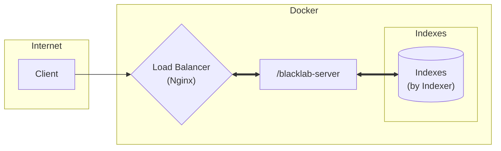

# **blacklab-demo**

This repository demonstrates how to build Blacklab corpus via Docker and Nginx.

## **Overview of the Architecture**



## **Documentation**

### 1. Installation

Clone the repository and make sure you are in the project directory

```bash
git@github.com:PTT-Corpus/blacklab-demo.git && cd blacklab-demo
```

### 2. Create indexes for Blacklab server

To index your data, you need to add your xml data to the folder `/tei-data` (in `./indexer/tei-data`).

```
deployment\
 |-- ...
indexer\
 |-- formats\                  # custom blacklab index format
 |-- tei-data\
 |   |-- dcard_mock_data.xml   # dcard mock data
 |   |-- ptt_mock_data.xml     # ptt mock data
 |-- ...
server\
 |-- ...
```

> Inside the folder contains two types of data (i.e. [PTT](https://term.ptt.cc/) and [Dcard](https://www.dcard.tw/f)). You can delete them anytime.

We assume here that you are familiar with the BlackLab indexing process; see [indexing with BlackLab](https://inl.github.io/BlackLab/indexing-with-blacklab.html) to learn more.

### 3. Build the server

To build the server for the first time:

```bash
docker compose up
```

Your index should now be accessible at http://localhost/blacklab-server/indexes

Once the server builds successfully, a folder `blacklab-data` will be generated by and used by the blacklab server (i.e. its corresponding Docker container).

Hereafter, if you want let the blacklab server add new indexes, you need to stop the blacklab server by:

```bash
docker compose down
```

Then add your new xml files to the folder `./indexer/tei-data`, and run:

```bash
docker compose up --force-recreate
```

## Contact Me

If you have any suggestion or question, please do not hesitate to email me at philcoke35@gmail.com
