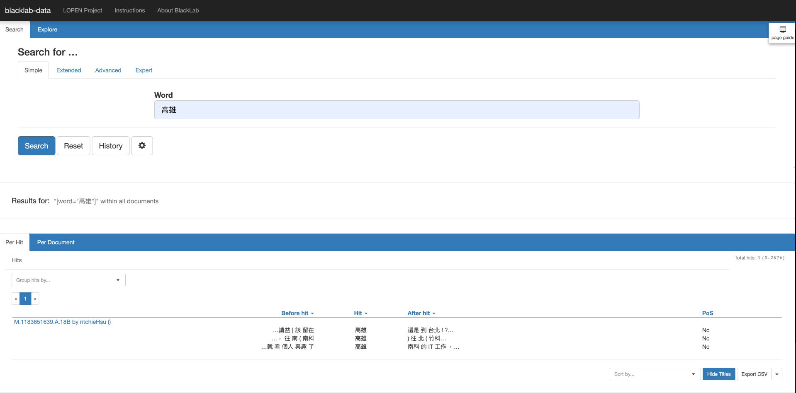
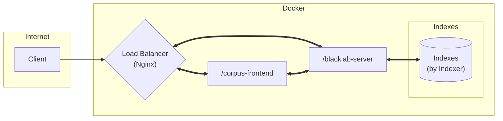

# **ptt-blacklab-demo**
This repository demonstrates how to build Blacklab corpus via Docker and Nginx. 

    

## **Overview of the Architecture**

## **Setup the server**
### 1. Create indexes for Blacklab server

### 2. Build the server

## Contact Me
If you have any suggestion or question, please do not hesitate to email me at philcoke35@gmail.com